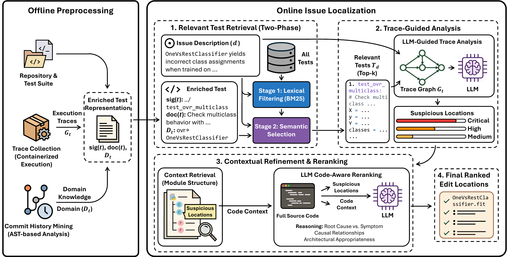

<div align="center">

# IssueExec

### A Test-Driven Approach for Localizing Software Engineering Issues

[](https://conf.researchr.org/details/issta-2026/issta-2026-research-papers/199/IssueExec-A-Test-Driven-Approach-for-Localizing-Software-Engineering-Issues)
[](https://www.python.org/)
[](https://www.swebench.com/)
[](https://arxiv.org/abs/2607.17286)

**Tests as executable requirements for issue localization.**

[English](README.md) · [简体中文](README.zh-CN.md)

</div>

IssueExec is the artifact accompanying **“IssueExec: A Test-Driven Approach for Localizing Software Engineering Issues,” accepted at ISSTA 2026**. It treats a repository's test suite as an executable specification: issue-relevant tests provide a requirement-level semantic bridge, and their runtime traces ground that bridge in concrete implementation locations.

> **Paper:** Jiawei Liu, Yun Lin, Chenyan Liu, Yu Qian, Yiming Liu, Jiaxin Chang, Weinan Zhang, and Linpeng Huang. [ISSTA 2026 research paper](https://conf.researchr.org/details/issta-2026/issta-2026-research-papers/199/IssueExec-A-Test-Driven-Approach-for-Localizing-Software-Engineering-Issues) · [arXiv:2607.17286](https://arxiv.org/abs/2607.17286)

## Framework

The IssueExec framework combines offline preprocessing with online issue localization. It retrieves relevant tests, analyzes their execution traces, refines the context, and produces ranked edit locations.

<p align="center">
  
</p>

*IssueExec framework overview.*

## Dynamic trace collection

The batch dynamic-tracing stage used to build IssueExec's execution-path inputs is maintained in a companion repository:

**[Dynamic trace collection](https://github.com/AWGiaGia/swe-tools)**

That tool runs the tests inside SWE-bench Docker environments, registers a Python `call`/`return` hook, filters instrumentation noise, and exports per-test `tests-info.json` and `traces.json` artifacts. IssueExec consumes these traces in the test-driven localization stages described below. See the companion repository's README for installation, Docker orchestration, output schemas, and reproducibility instructions.

## Repository at a glance

The source tree is organized around one Python package, while the two root-level scripts preserve the original command-line interface:

```text
IssueExec/
├── issueexec/
│   ├── cli.py                 # localization pipeline CLI
│   ├── localizer.py           # retrieval, analysis, and reranking stages
│   ├── merge.py               # result merging
│   ├── prompts.py             # LLM prompt templates
│   └── utils/                 # data, repository, model, and post-processing helpers
├── localize.py                # compatibility launcher
├── merge.py                   # compatibility launcher
├── assets/framework.png       # framework overview figure
├── example_data.tar.gz        # reproducible example package
├── requirements.txt
└── README.md / README.zh-CN.md
```

| Path | Purpose |
| --- | --- |
| [`localize.py`](localize.py) | Backward-compatible CLI wrapper |
| [`merge.py`](merge.py) | Backward-compatible result-merging wrapper |
| [`issueexec/cli.py`](issueexec/cli.py) | Multi-stage localization CLI implementation |
| [`issueexec/localizer.py`](issueexec/localizer.py) | Test retrieval, trace analysis, candidate localization, and reranking |
| [`issueexec/prompts.py`](issueexec/prompts.py) | Prompts used by the localization stages |
| [`issueexec/merge.py`](issueexec/merge.py) | Result-merging implementation |
| [`issueexec/utils/`](issueexec/utils/) | Data preparation, repository indexing, API clients, domain knowledge, and post-processing |
| [`example_data.tar.gz`](example_data.tar.gz) | Small example package containing issue inputs and auxiliary artifacts |
| [`requirements.txt`](requirements.txt) | Python dependencies used by the artifact |

## Quick start

### 1. Install dependencies

```bash
git clone git@github.com:code-philia/IssueExec.git
cd IssueExec
python -m pip install -r requirements.txt
```

IssueExec calls an OpenAI-compatible, DeepSeek-compatible, or Anthropic-compatible backend. Configure the credentials for the backend you select; never commit secrets:

```bash
# OpenAI-compatible example
export OPENAI_BASE_URL="<openai_base_url>"
export OPENAI_API_KEY="<your_api_key>"
```

### 2. Prepare the example data

```bash
tar -xzf example_data.tar.gz
```

This creates `example_data/issues/test` and the auxiliary coverage artifacts used by the example commands below.

### 3. Run the complete localization pipeline

Each stage writes `loc_outputs.jsonl` below `example/<stage>/`. The next stage consumes the previous stage's output through `--start_file`.

#### Stage 1 — retrieve requirement-relevant tests

```bash
python localize.py \
  --stage related_tests_retrieval \
  --output_folder example \
  --num_threads 2 \
  --skip_existing \
  --model gpt-4o-2024-05-13 \
  --backend openai \
  --top_n 5 \
  --dataset example_data/issues/test \
  --coverage_graph_path example_data/coverage_graph
```

The root-level commands remain stable compatibility entry points. The implementation is organized under the `issueexec/` package.

Output: `example/related_tests_retrieval/loc_outputs.jsonl`.

#### Stage 2 — analyze false negatives and execution traces

```bash
python localize.py \
  --stage blind_spot_analysis \
  --output_folder example \
  --num_threads 2 \
  --skip_existing \
  --start_file example/related_tests_retrieval/loc_outputs.jsonl \
  --model gpt-4o-2024-05-13 \
  --backend openai \
  --dataset example_data/issues/test
```

Output: `example/blind_spot_analysis/loc_outputs.jsonl`.

#### Stage 3 — supplementary retrieval

```bash
python localize.py \
  --stage suppletory_retrieval \
  --output_folder example \
  --num_threads 2 \
  --skip_existing \
  --start_file example/blind_spot_analysis/loc_outputs.jsonl \
  --model gpt-4o-2024-05-13 \
  --backend openai \
  --dataset example_data/issues/test
```

Output: `example/suppletory_retrieval/loc_outputs.jsonl`.

#### Stage 4 — merge candidate sources

```bash
python merge.py --target_folder example
```

Output: `example/merge/loc_outputs.jsonl`.

#### Stage 5 — rerank final edit locations

```bash
python localize.py \
  --stage reranking \
  --output_folder example \
  --num_threads 2 \
  --skip_existing \
  --start_file example/merge/loc_outputs.jsonl \
  --model gpt-4o-2024-05-13 \
  --backend openai \
  --context_expansion \
  --dataset example_data/issues/test
```

The final output is `example/reranking/loc_outputs.jsonl`, containing ranked locations for downstream patch generation.

## Configuration notes

- `--model` accepts `gpt-4o-2024-05-13`, `gpt-4o-mini-2024-07-18`, `deepseek-coder`, and `claude-3-5-sonnet-20241022`.
- Match `--backend` to the selected model provider (`openai`, `deepseek`, or `anthropic`).
- Use `--use_online_domain_knowledge` to collect domain knowledge only for BM25-filtered tests. Alternatively, pass precomputed per-instance files with `--domain_knowledge_path`.
- `--context_expansion` enables full code context during reranking; `--suppletory_context_level module` changes supplementary retrieval from file-level to module-level context.
- `--repo_cache_dir` controls temporary SWE-bench repository checkouts (default: `/tmp/swe_bench_repos`).
- Outputs and logs are intentionally ignored by Git. Keep API keys in environment variables or a local `.env` file that is not committed.

## Reproducibility checklist

- [ ] Install the pinned dependencies from `requirements.txt`.
- [ ] Configure the selected model backend and credentials.
- [ ] Extract `example_data.tar.gz`.
- [ ] Run stages 1–5 in order, preserving each `loc_outputs.jsonl` path.
- [ ] Record the model, backend, dataset path, and number of workers used for each run.

The repository is intended for research reproduction and extension. API calls may incur provider-specific cost and latency; `--skip_existing` can resume an interrupted run.

## Citation

```bibtex
@article{liu2026issueexec,
  title   = {IssueExec: A Test-Driven Approach for Localizing Software Engineering Issues},
  author  = {Liu, Jiawei and Lin, Yun and Liu, Chenyan and Qian, Yu and Liu, Yiming and Chang, Jiaxin and Zhang, Weinan and Huang, Linpeng},
  journal = {Proceedings of the ACM on Software Engineering},
  volume  = {3},
  number  = {ISSTA},
  year    = {2026}
}
```

## Contact

For questions about the artifact, please open a [GitHub issue](https://github.com/code-philia/IssueExec/issues) or contact the authors listed in the paper.
